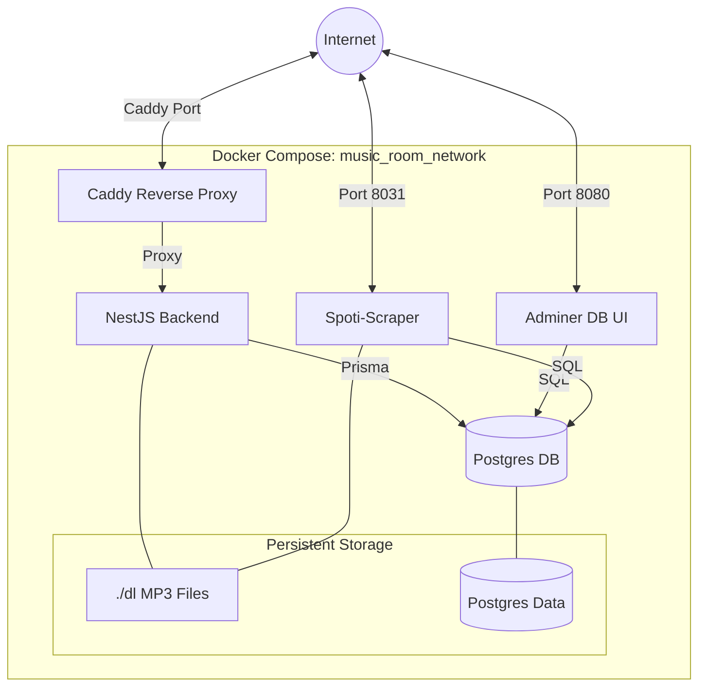
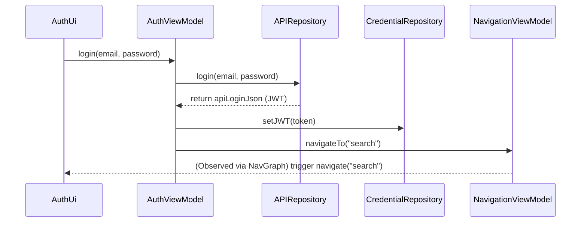
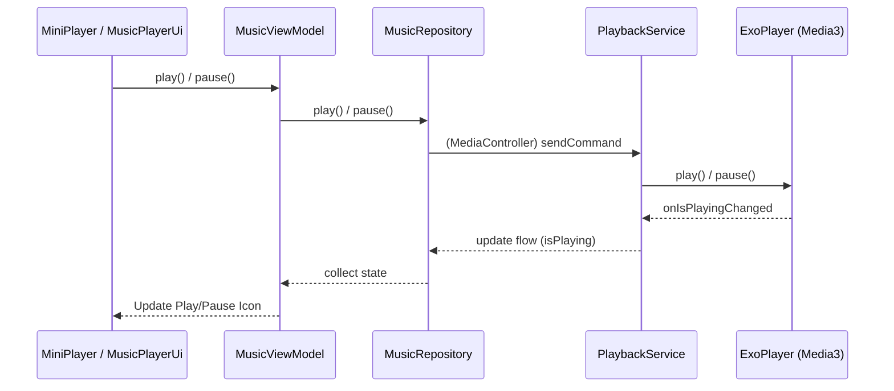
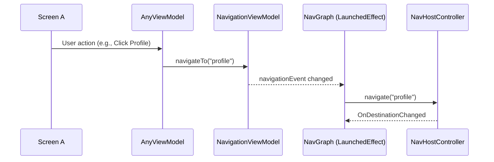

# MusicRoom
42 project where you have to make a music streaming service

## Team members & work repartition:
| name      | worked on        |
|-----------|------------------|
| nalebrun  | Android app, caddy, spotiscraper, ytdownloader |
| lvodak    | Backend          |
| jgoudema  | Frontend         |
| ajossera  | Backend          |

## Git structure :
```text
main
│
├── android-app         // the main branch for the kotlin android app
│   ├── /auth/login     // ex  sub branches for linked feature
│   └── /fix-bug-xxxx   // ex
│
├── dev                 // the main branch for the nest backend
│   ├── /auth/login     // ex
│   └── /fix-bug-xxxx   // ex
```
for each feature or bug fix: an `issue`, a `branch` and a `pull request` have to be oppened

## Docker Structure

The project is orchestrated using Docker Compose. The following diagram illustrates the service architecture, networking, and volume mounts:



## Backend

Git main branch for this project part : `dev`

The backend is a clasic Nestjs Structure based on Services that will be composed with Service for logic and link to the database, controllers for the API's and Modules for the inside structure and dependencies between services. The full backend use the principle of RestAPI and is documented with swaggers.
The database used for the project, PostgreSQL, is connected to the backend through a ORM named prisma, that will handles most query's through each related services. The tables schemas are written manually in the scema.prisma.
There is 4 distinct kind of service: Music related, User related, Devices and Notifications.
For the authentifictaion, we have used the concept of JSON Web Token (JWT), to keep the authentification after log in. The account creation is protected with an email verification system (SMTP). And in addition, the oauth service has been implemented for google authentification.
The Musics services handle the link between artist, music and albums as well as the playlist system that will be share with other users.
The Devices service mostly used a websocket system to communicate change in playlists and shared Music Room (and so does the playlist one).
A Firebase Notification system was attempted, but is not used, but could be easely implemented in the front end to join what is already present (some part commented) in the backend.
For each Services that used Controllers and therefore API's, dto files are present to structure the body of each request API as well as the answer body, to ensure and enforce a proper used of each route used.
All of of this is dockerized and run on a containerized caddy server that handle https request and can handle http with the right change in .env files. The backend and Database are each in separte containers.
The credentials and sensitives data are kept in secrets files or .env depending on the level of security needed.
 

## Android-app

Git main branch for this project part : `android-app`

Music Room is a Kotlin-based Android application designed for collaborative music playback and management. The project strictly follows the MVVM (Model-View-ViewModel) architectural pattern to ensure a clean separation of concerns between the UI, business logic, and data layers. While developed using Kotlin, which offers potential for future iOS compatibility via Kotlin Multiplatform, the application is currently optimized and intended exclusively for the Android platform.

### 1. App Structure (File Tree)

```text
app/src/main/java/be/nalebrun/musicroom/
├── apiJsonStruct/          # Data classes for API requests and responses
│   ├── requests/
│   └── responds/
├── di/                     # Dependency Injection (Hilt modules)
│   ├── NetworkModule.kt
│   └── RepositoryModule.kt
├── keys/                   # Preference keys
│   └── PreferenceKey
├── repositories/           # Data layer (API, Socket, Preferences)
│   ├── APIRepository.kt
│   ├── CredentialRepository.kt
│   ├── MusicRepository.kt
│   ├── SettingsRepository.kt
│   ├── SocketIORepository.kt
│   └── UiMessageManager.kt
├── services/               # Background services
│   └── PlaybackService.kt  # Media3 MediaSession & ExoPlayer
├── ui/                     # UI Layer (Jetpack Compose)
│   ├── element/            # Reusable UI components (MiniPlayer, Navigation, etc.)
│   ├── screen/             # Main screens (Auth, Library, MusicPlayer, etc.)
│   └── theme/              # Material Design theme definitions
├── viewmodel/              # ViewModel Layer
│   ├── AuthViewModel.kt
│   ├── MusicViewModel.kt
│   ├── NavigationViewModel.kt
│   ├── SocketViewModel.kt
│   └── ...
├── DataStore.kt            # DataStore initialization
├── MainActivity.kt         # Entry point
├── MusicRoomApp.kt         # Application class
├── NavGraph.kt             # Navigation definition
└── ...
```

### 2. Some Interaction Diagrams

#### A. Auth Flow
Process of logging in and transitioning to the main application.



#### B. Music Playback Flow
How the UI interacts with the playback engine.



#### C. Navigation Example
Centralized navigation logic via `NavigationViewModel`.



### 3. Key Components Description

- **NavigationViewModel**: Acts as a central event bus for navigation. ViewModels call `navigateTo(route)` which is observed by the `NavGraph` in a `LaunchedEffect`.
- **MusicRepository**: The single source of truth for current playback state, queue, and remote control status.
- **PlaybackService**: A Media3 `MediaSessionService` that wraps `ExoPlayer`, allowing playback to continue in the background and integrating with system media controls.
- **SocketIORepository**: Handles the low-level Socket.IO connection, reconnections, and event listeners.
- **SocketViewModel**: Orchestrates the business logic for real-time features like joining a "music room" and syncing playback commands between devices.

## Server Client WS communication
ToDo
